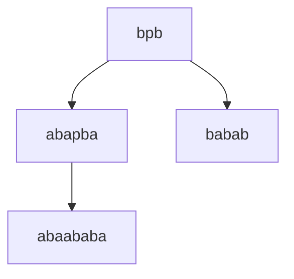
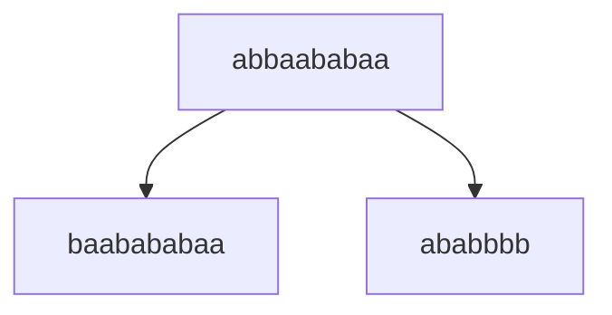

# Лабораторная работа №1
## Задание:  
По имеющейся **SRS** определить: 
- завершимость
- конечность классов эквивалентности по НФ (для построения эквивалентностей считаем, что правила могут применяться в обе стороны). Если их конечное число, то построить минимальную систему переписывания, им соответствующую.
- локальную конфлюэнтность и пополняемость по Кнуту-Бендиксу  

### 1. Докажем завершимость
Система переписывания:
* $\texttt{bpb} \to \texttt{abapba}$
* $\texttt{p} \to \texttt{aba}$
* $\texttt{apa} \to \texttt{bb}$
* $\texttt{abba} \to \texttt{baab}$

Рассмотрим количество вхождений символа $p$ в слово $w$

$|w|_p$ уменьшается на 1 с каждым применением правил $\texttt{p} \to \texttt{aba}$ и $\texttt{apa} \to \texttt{bb}$, однако оставшиеся два правила из системы оставляют количество символов $p$ неизменным. 

Далее, пусть $a > b$. Тогда правило $\texttt{abba} \to \texttt{baab}$ уменьшает строку лексикографически. 

Остается одно проблемное правило, не убывающее ни по одной из приведенных мер: $\texttt{bpb} \to \texttt{abapba}$. Почему оно не может создать бесконечную цепочку переписываний? 

После применения этого правила, вокруг буквы $p$ образуется подстрока $apb$, окруженная подсловами $ab$ и $ba$. Одно из возможных для применения правило в такой ситуации — это $\texttt{p} \to \texttt{aba}$. Получаем подстроку $abaababa$, которая не содержит потенциально бесконечного цикла. 

Перейдем к рассмотрению краевых случаев при применении данного правила. Бесконечный цикл может быть получен только при пересечении с правилом $\texttt{abba} \to \texttt{baab}$, однако это правило не меняет длину слова, то есть подстрока $abba$ просто "мигрирует" по слову, пока цепочка переписываний не сойдется к одному из трех случаев: 

1. Миграция происходила с конца в начало: $ba(ab)^n$
2. Наоборот: $(ba)^nab$
3. В середину: $(ba)^n(ab)^n$

Рассмотрим ситуацию, когда мы не применяем правила, которые убирают символ $p$. Имеем $w = u(bpb)v = u(abapba)v$

Чтобы получить бесконечную цепочку, нужно, чтобы 
  

Таким образом, ***система завершима***, так как в ней невозможно построить бесконечых циклов переписывания.

### 2. Классы эквивалентности по НФ

Число нормальных форм **бесконечно**: к примеру, каждое слово из $a^n$, $b^n$ при $n >= 1$ будет давать бесконечное число различных нормальных форм. 

### 3. Локальная конфлюэнтность

Рассмотрим слово $w = bpb$, содержащее в себе критическую пару. 

$w \to v_1, v_1 = babab$ при применении правила $\texttt{p} \to \texttt{aba}$
$w \to v_2, v_2 = abaababa$ при применении правила $\texttt{bpb} \to \texttt{abapba}$. 

**Локальной конфлюэнтности нет**, так как $v_1$ и $v_2$ являются нормальными формами (не содержат редексов).

### 4. Пополняемость по Кнуту-Бендиксу
По алгоритму Кнута-Бендикса, добавляем правило по критической паре из правил $\texttt{p} \to \texttt{aba}$ и $\texttt{apa} \to \texttt{bb}$:

* $\texttt{aabaa} \to \texttt{bb}$

Оно формирует критическую пару с правилом  $\texttt{abba} \to \texttt{baab}$. Поэтому добавляем:

* $\texttt{baababaa} \to \texttt{abbbb}$

Оно формирует критическую правилу с правилом $\texttt{abba} \to \texttt{baab}$:

Новое правило, извлеченное из этой крит. пары, будет также формировать крит. пару с правилом $\texttt{abba} \to \texttt{baab}$. Таким образом, алгоримт Кнута-Бендикса будет бесконечно добавлять правила вида:

$$
baa(ba)^{n+1}baa \to (ab)^nabbbb
$$

Следовательно, процедура пополнения не завершится конечным числом правил, и система **непополянема по алгоритму Кнута-Бендикса**. 

### 5. Инварианты

1. Количество букв $p$ (монотонно)
2. Количество букв $b$ (монотонно)
3. $(|a| + |b|)mod 3$
