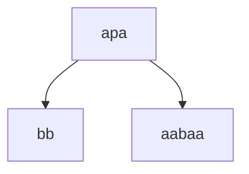

# Лабораторная работа №1
## Задание:  
По имеющейся **SRS** определить: 
- завершимость
- конечность классов эквивалентности по НФ (для построения эквивалентностей считаем, что правила могут применяться в обе стороны). Если их конечное число, то построить минимальную систему переписывания, им соответствующую.
- локальную конфлюэнтность и пополняемость по Кнуту-Бендиксу  

### 1. Докажем завершимость
Система переписывания:
* $\texttt{bpb} \to \texttt{abapba}$
* $\texttt{p} \to \texttt{aba}$
* $\texttt{apa} \to \texttt{bb}$
* $\texttt{abba} \to \texttt{baab}$

##### Рассмотрим отображение $F_1: \Sigma^* \to \mathbb{N}$ 

$F_1(w) := |w|_p$

(количество вхождений символа $p$ в слово $w$)

$F_1$ строго убывает при применении правил $\texttt{p} \to \texttt{aba}$ и $\texttt{apa} \to \texttt{bb}$, однако оставшиеся два правила из системы оставляют значение $F_1$ неизменным. 

Значит, для определения фундированного порядка необходимо ввести лексикографический порядок над $\Sigma^*$. 

##### Рассмотрим отображение $F_2: \Sigma^* \to \mathbb{N}$ 

$F_2(w) := |w|_{bp}$

(количество вхождений подстроки $bp$ в слово $w$)

$F_2$ строго убывает при применении правила $\texttt{bpb} \to \texttt{abapba}$, при применении остальных правил $F_2(LHS) = F_2(RHS)$.

Определим функцию $f: \Sigma \to \mathbb{N}$ и пусть 

$f(a) := 1, f(b) := 0, f(p) := 0$

##### Рассмотрим отображение  $F_3: \Sigma^* \to \mathbb{N}$ 

$F_3(w) := \sum_{i=0}^{|w|-1} f(w[i])2^{|w|-i-1}$

(воспринимаем любое слово в виде двоичного числа, а после переводим его в десятичную систему).

$F_3$ строго убывает при применении правила $\texttt{abba} \to \texttt{baab}$, в то время как $F_1$ и $F_2$ не меняют своего значения. 

Таким образом, определяем над множеством $\Sigma^*$ лексикографический порядок через отображение $F: \Sigma^* \to \mathbb{N}^3$ 

$F(w) := (F_1, F_2, F_3)$

Изначально рассматриваем количество вхождений символа $p$, при равенстве рассматриваем количество вхождений подстроки $bp$, при условии равенства вхождений и это подстроки, рассматриваем вес слова в двоичной системе. 

Для каждого правила $F(LHS) > F(RHS)$, значит, **система завершима**

### 2. Классы эквивалентности по НФ

Число нормальных форм бесконечно: к примеру, каждое слово из $a^n$, $b^n$ при $n >= 1$ будет давать бесконечное число различных нормальных форм. 

### 3. Локальная конфлюэнтность

Рассмотрим слово $w = apa$, содержащее в себе критическую пару. 

$w \to v_1, v_1 = bb$ при применении правила $\texttt{apa} \to \texttt{bb}$
$w \to v_2, v_2 = aabaa$ при применении правила $\texttt{p} \to \texttt{aba}$. 

Локальной конфлюэнтности нет, так как $v_1$ и $v_2$ являются нормальными формами (не содержат редексов).

### 4. Пополняемость по Кнуту-Бендиксу

