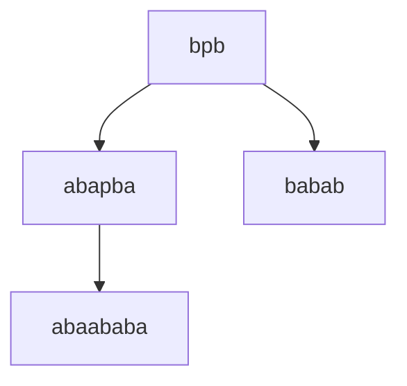
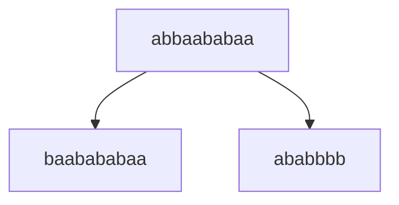

# Лабораторная работа №1
## Задание:  
По имеющейся **SRS** определить: 
- завершимость
- конечность классов эквивалентности по НФ (для построения эквивалентностей считаем, что правила могут применяться в обе стороны). Если их конечное число, то построить минимальную систему переписывания, им соответствующую.
- локальную конфлюэнтность и пополняемость по Кнуту-Бендиксу  

### 1. Докажем завершимость
Система переписывания:
* $\texttt{bpb} \to \texttt{abapba}$
* $\texttt{p} \to \texttt{aba}$
* $\texttt{apa} \to \texttt{bb}$
* $\texttt{abba} \to \texttt{baab}$

##### Применение правил 2 и 3

* $\texttt{p} \to \texttt{aba}$
* $\texttt{apa} \to \texttt{bb}$

Каждое из приведенных правил уменьшает количество символов $p$ в строке на единицу, значит, не может быть применимо более, чем $|w|_p$ раз, что исключает возможность появления бесконечной цепочки с помощью этих правил. 

##### Применение правила 4

* $\texttt{abba} \to \texttt{baab}$

Выведем ограничение на количество применения этого правила следующим образом: для начала представим a и b в виде 1 и 0 соответственно, таким образом, 

$$ab = 10_2 = 2_{10}, ba = 01_2 = 1_{10}$$

 и правило 

 $$\texttt{abba} \to \texttt{baab}$$ 
 
 преобразуется в 
 
 $$21 \to 12$$

 То есть количество возможных применений правила к произвольному слову $w$ ограничевается количеством инверсий $ba$ и $ab$, где $ba < ab$. 

 Иначе говоря, при применении этого правила к строке $w$ происходит сортировка пар $ba$ и $ab$, позиции $ba$ уменьшаются.

 ##### Применение правила 1 

Рассмотрим $w_1bpbw_2$. Применяя правило 4 к $w_1$, и применяя правило 1 к $bpb$, мы можем столкнуться с неприятной ситуацией и сгенерировать новую $b$ слева от оставшегося $bp$:

$$ abbbpb \to abbabapba \to baabbapba \to babaabpba \to babaaabapbaa $$

Мы видим, что после второго применения правила $bpb$ к рассматриваемой $p$ перед ней возникает подстрока $aaba$. Для того, чтобы применить к указанной $p$ правило 1 еще раз, нужно, чтобы из $aaba$ мы могли получить $abba$. Однако ни по каким из правил 2, 3 и 4 сделать этого больше невозможно. Значит, правило 1 к одной и той же $p$ можно применить лишь конечное число раз. По-сути, это правило уменьшает количество подстрок $bbb$ в определенных контекстах, а правило 4  в свою очередь уменьшает количество подстрок $bb$ за конечное число шагов.

### 2. Классы эквивалентности по НФ

Число нормальных форм **бесконечно**: к примеру, каждое слово из $a^n$, $b^n$ при $n >= 1$ будет давать бесконечное число различных нормальных форм. 

### 3. Локальная конфлюэнтность

Рассмотрим слово $w = bpb$, содержащее в себе критическую пару. 

```mermaid
graph TD
bpb-->abapba
abapba-->abaababa
bpb-->babab
```
$w \to v_1, v_1 = babab$ при применении правила $\texttt{p} \to \texttt{aba}$
$w \to v_2, v_2 = abaababa$ при применении правила $\texttt{bpb} \to \texttt{abapba}$. 

**Локальной конфлюэнтности нет**, так как $v_1$ и $v_2$ являются нормальными формами (не содержат редексов).

### 4. Пополняемость по Кнуту-Бендиксу
По алгоритму Кнута-Бендикса, добавляем правило по критической паре из правил $\texttt{p} \to \texttt{aba}$ и $\texttt{apa} \to \texttt{bb}$:

* $\texttt{aabaa} \to \texttt{bb}$

Оно формирует критическую пару с правилом  $\texttt{abba} \to \texttt{baab}$. Поэтому добавляем:

* $\texttt{baababaa} \to \texttt{abbbb}$

Оно формирует критическую правилу с правилом $\texttt{abba} \to \texttt{baab}$:

```mermaid
graph TD
abbaababaa-->baabababaa
abbaababaa-->ababbbb
```
Новое правило, извлеченное из этой крит. пары, будет также формировать крит. пару с правилом $\texttt{abba} \to \texttt{baab}$. Таким образом, алгоримт Кнута-Бендикса будет бесконечно добавлять правила вида:

$$
baa(ba)^{n+1}baa \to (ab)^nabbbb
$$

Следовательно, процедура пополнения не завершится конечным числом правил, и система **непополянема по алгоритму Кнута-Бендикса**. 

### 5. Инварианты

1. Количество букв $p$ (монотонно)
2. Количество букв $b$ (монотонно)
3. $(|a| + |b|)mod 3$
