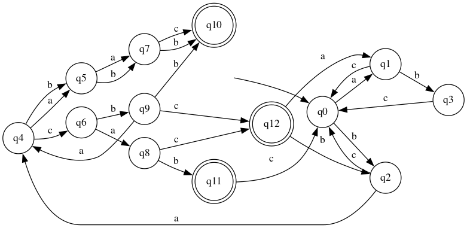
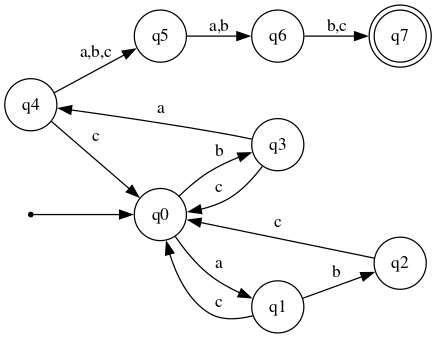
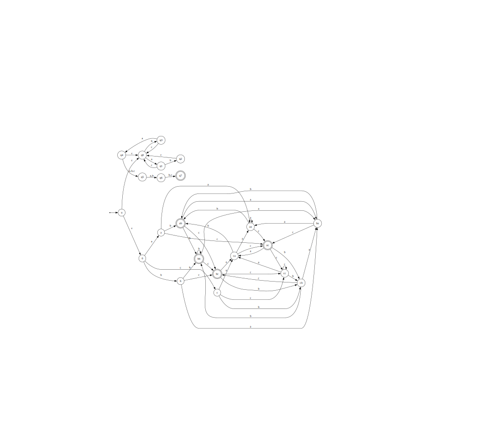
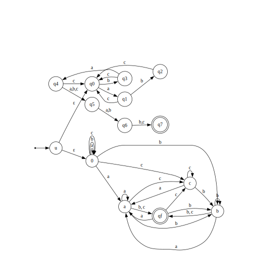

# Лабораторная работа №2

## Задание: 

По имеющемуся академическому регулярному выражению построить:

1. Минимальный ДКА, распознающий ее язык (минимальность обосновать таблицей классов эквивалентности)
2. Возможно малый НКА, возможно малый ПКА, распознающий ее язык (частично обосновать через таблицы множеств классов эквивалентности)
3. Расширенное регулярное выражение, распознающее тот же язык
4. Провести автоматическое тестирование предполагаемой эквивалентности

Выражение: $(abc|bc|ac|bac)^*ba(a|b|c)(a|b)(b|c)$

### 1. Построить ДКА и обосновать минимальность через таблицу классов эквивалентности

Построенный ДКА (файл DFA.dot), 13 состояний:

Таблица классов эквивалентности:

|        | ε | c | cbabab | bb | acbaaab | bcbaaab | bbc |
|--------|---|---|--------|----|---------|---------|-----|
| ε      | 0 | 0 | 0      | 0  | 1       | 1       | 0   |
| a      | 0 | 0 | 1      | 0  | 0       | 1       | 0   |
| b      | 0 | 0 | 1      | 0  | 1       | 0       | 0   |
| ab     | 0 | 0 | 1      | 0  | 0       | 0       | 0   |
| ba     | 0 | 0 | 1      | 0  | 0       | 0       | 1   |
| bacab  | 1 | 0 | 1      | 0  | 0       | 0       | 0   |
| bac    | 0 | 0 | 0      | 1  | 1       | 1       | 0   |
| bacb   | 0 | 1 | 1      | 0  | 1       | 0       | 0   |
| bacbb  | 1 | 0 | 0      | 0  | 0       | 0       | 0   |
| baca   | 0 | 1 | 1      | 0  | 0       | 1       | 0   |
| bacac  | 1 | 0 | 0      | 0  | 1       | 1       | 0   |
| bab    | 0 | 0 | 0      | 1  | 0       | 0       | 0   |
| babb   | 0 | 1 | 0      | 0  | 0       | 0       | 0   |

### 2. НКА

Получилось построить НКА на 8 состояний, используя недетерминизм для обработке блока $bac$, который может быть как стартом "хвоста" $baXYZ$, так и входить в блок $(bac|bc|ac|abc)^*$

Можно частично обосновать минимальность построенного НКА таблицей: 

|                   | bcbacac | cbaaab | bb | babbb | aaac | c | abc | ε |
| ----------------- | ------- | ------ | -- | ----- | ---- | - | --- | - |
|   a               | 1       | 1      | 0  | 0     | 0    | 0 | 0   | 0 |
|   ab              | 0       | 1      | 0  | 0     | 0    | 0 | 0   | 0 |
|   baa             | 0       | 0      | 1  | 0     | 0    | 0 | 0   | 0 |
|   ac              | 1       | 0      | 0  | 1     | 0    | 0 | 0   | 0 |
|   b               | 0       | 1      | 0  | 0     | 1    | 0 | 0   | 0 |
|   babb            | 0       | 0      | 0  | 0     | 0    | 1 | 0   | 0 |
|   ba              | 0       | 1      | 0  | 0     | 0    | 0 | 1   | 0 |
|   bacac           | 1       | 0      | 0  | 1     | 0    | 0 | 0   | 1 |

### 3. ПКА

Построим ПКА, представив регулярку как пересечение языков

1. $L_1 = (abc|bc|bac|ac)^*ba(a|b|c)(a|b)(b|c)$  
2. $L_2 = (a|b|c)^*(bb|bc|ac|ab|bb)$ (слова, заканчивающиеся на один из четырех суффиксов)

Конъюнкция НКА с НКА:

### 4. Расширенная регулярка

^((?:(?=abc)...|(?=bc)..|(?=ac)..|(?=bac)...)+)?(?=ba)..(?=(?:a|b|c)(?:a|b)(?:b|c))...$

#### Пояснение эквивалентности регулярных выражений:

1. Каждое X* переписано как ((X)+)?, что задаёт тот же язык: либо пустая строка, либо один или больше повторов X.
Здесь: (abc|bc|ac|bac)* -> ((?:(?=abc)...|(?=bc)..|(?=ac)..|(?=bac)...)+)?.

2. Альтернативы abc|bc|ac|bac заменены на блоки с look-ahead:
abc → (?=abc)..., bc → (?=bc).., ac → (?=ac).., bac → (?=bac)....
Lookahead проверяет конкретную подстроку, ../... считывают ровно её длину, язык не меняется.

3. ba переписано как (?=ba)..: просмотр вперёд гарантирует, что дальше ba, две точки читают ровно эти два символа.

4. Хвост (a|b|c)(a|b)(b|c) переписан как (?=(?:a|b|c)(?:a|b)(?:b|c))...: lookahead проверяет, что следующие три символа удовлетворяют тем же ограничениям, ... читает ровно три символа.