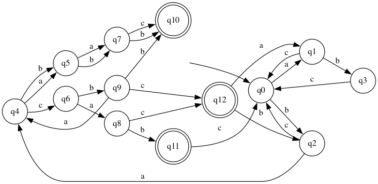
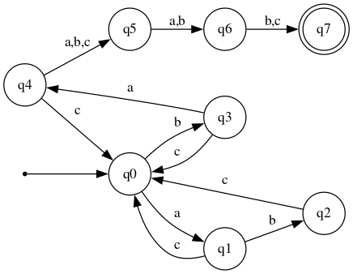

# Лабораторная работа №2

## Задание: 

По имеющемуся академическому регулярному выражению построить:

1. Минимальный ДКА, распознающий ее язык (минимальность обосновать таблицей классов эквивалентности)
2. Возможно малый НКА, возможно малый ПКА, распознающий ее язык (частично обосновать через таблицы множеств классов эквивалентности)
3. Расширенное регулярное выражение, распознающее тот же язык
4. Провести автоматическое тестирование предполагаемой эквивалентности

Выражение: $(abc|bc|ac|bac)^*ba(a|b|c)(a|b)(b|c)$

### 1. Построить ДКА и обосновать минимальность через таблицу классов эквивалентности

Построенный ДКА (файл DFA.dot), 13 состояний:

Таблица классов эквивалентности:

|        | ε | c | cbabab | bb | acbaaab | bcbaaab | bbc |
|--------|---|---|--------|----|---------|---------|-----|
| ε      | 0 | 0 | 0      | 0  | 1       | 1       | 0   |
| a      | 0 | 0 | 1      | 0  | 0       | 1       | 0   |
| b      | 0 | 0 | 1      | 0  | 1       | 0       | 0   |
| ab     | 0 | 0 | 1      | 0  | 0       | 0       | 0   |
| ba     | 0 | 0 | 1      | 0  | 0       | 0       | 1   |
| bacab  | 1 | 0 | 1      | 0  | 0       | 0       | 0   |
| bac    | 0 | 0 | 0      | 1  | 1       | 1       | 0   |
| bacb   | 0 | 1 | 1      | 0  | 1       | 0       | 0   |
| bacbb  | 1 | 0 | 0      | 0  | 0       | 0       | 0   |
| baca   | 0 | 1 | 1      | 0  | 0       | 1       | 0   |
| bacac  | 1 | 0 | 0      | 0  | 1       | 1       | 0   |
| bab    | 0 | 0 | 0      | 1  | 0       | 0       | 0   |
| babb   | 0 | 1 | 0      | 0  | 0       | 0       | 0   |

### 2. НКА

Получилось построить НКА на 8 состояний, используя недетерминизм для обработке блока $bac$, который может быть как стартом "хвоста" $baXYZ$, так и входить в блок $(bac|bc|ac|abc)^*$

Можно обосновать минимальность построенного НКА таблицей: 

|                   | bcbacac | cbaaab | bb | babbb | aaac | c | abc | ε |
| ----------------- | ------- | ------ | -- | ----- | ---- | - | --- | - |
|   a               | 1       | 1      | 0  | 0     | 0    | 0 | 0   | 0 |
|   ab              | 0       | 1      | 0  | 0     | 0    | 0 | 0   | 0 |
|   baa             | 0       | 0      | 1  | 0     | 0    | 0 | 0   | 0 |
|   ac              | 1       | 0      | 0  | 1     | 0    | 0 | 0   | 0 |
|   b               | 0       | 1      | 0  | 0     | 1    | 0 | 0   | 0 |
|   babb            | 0       | 0      | 0  | 0     | 0    | 1 | 0   | 0 |
|   ba              | 0       | 1      | 0  | 0     | 0    | 0 | 1   | 0 |
|   bacac           | 1       | 0      | 0  | 1     | 0    | 0 | 0   | 1 |

### 3. ПКА

Построим ПКА, представив регулярку как пересечение языков

1. $L_1 = (abc|bc|bac|ac)^*ba(a|b|c)^3$  
2. $L_2 = (a|b|c)^*(bb|bc|ac|ab)$ (слова, заканчивающиеся на один из четырех суффиксов)

Таблицы минимальности для ПКА (если я правильно поняла, как их тут строить):

|        | bcbaabc | aaac   |bab | cbacbc  | ab      | c   | ε | abcbaaa | b | baaaa | cbaaaa | aaaa | aaa |
|--------|---------|--------|----|---------|---------|-----|---|---------|---|-------|--------|------|-----|
| a      | 1       | 0      | 0  | 1       | 0       | 0   | 0 |   0     | 0 |   0   |   1    |  0   |   0 |
| b      | 0       | 1      | 0  | 1       | 0       | 0   | 0 |   0     | 0 |   0   |   1    |  1   |   0 |
| ba     | 0       | 0      | 1  | 1       | 0       | 0   | 0 |   0     | 0 |   0   |   1    |  0   |   1 |
| ab     | 0       | 0      | 0  | 1       | 0       | 0   | 0 |   0     | 0 |   0   |   1    |  0   |   0 |
| bab    | 0       | 0      | 0  | 0       | 1       | 0   | 0 |   0     | 0 |   0   |   0    |  0   |   0 |
| babc   | 0       | 0      | 0  | 0       | 0       | 1   | 0 |   0     | 1 |   0   |   0    |  0   |   0 |
| bacaa  | 0       | 0      | 0  | 0       | 0       | 0   | 1 |   0     | 0 |   0   |   0    |  0   |   0 |
| bac    | 1       | 0      | 0  | 0       | 1       | 0   | 0 |   1     | 0 |   1   |   0    |  0   |   0 |
| baca   | 1       | 0      | 0  | 1       | 0       | 1   | 0 |   0     | 1 |   0   |   1    |  0   |   0 |
| bacac  | 1       | 0      | 0  | 0       | 0       | 0   | 1 |   1     | 0 |  1    |   0    | 0    | 0   |
| bacab  | 0       | 0      | 0  | 1       | 0       | 0   | 1 |   0     | 0 |  0    |   1    |  0   | 0   |
| bacb   | 0       | 1      | 0  | 1       | 0       | 0   | 0 |   0     | 1 |  0    |   0    |   1  |  0  |
| bacba  | 0       | 0      | 1  | 1       | 0       | 0   | 1 |   0     | 0 |  0    |   1    |   0  |  1  |

|        | ac   | b    |  ε   |
|--------|------|------|------|
| сс     | 1    |  0   |  0   |
| сaa    |  1   |  1   |  0   |
| ab     |   1  |  1   |  1   |
| ac     |   1  |   0  |  1   |

### 4. Расширенная регулярка

^(ab?c|ba?c)*(?=.....$)ba.(a|b)(b|c)

#### Пояснение эквивалентности регулярных выражений:

1. Итерационный блок переписан для читаемости, по факту есть два варианта с вхождением b/a в середине или без

2. Использован lookahead для решения проблемы недетерминизма между bac, принадлежащем первому блоку, и bac, являющимся началом второго блока фиксированной длины

3. (a|b|c) в алфавите {a, b, c} заменен на .