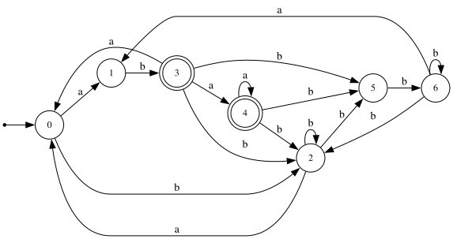

## Лабораторная работа №3 

Дана грамматика: 

* $S \to bTSa$
* $T \to aSTb$
* $S \to ab$
* $T \to bT$
* $T \to bb$
 
#### Анализ на детерминизм

Построим PDA для этого языка и проанализируем возникший недетерминизм: 

Недетерминизм возник лишь при чтении $b$ с вершиной стека $T$, где мы имеем два варианта развития событий: рекурсивно добавлять $b$ или воспользоваться правилом $T \to bb$

##### Докажем недетерминизм по лемме о накачке

При анализе языка без правила $T \to bT$ получается детерминизм, так как у нас нет проблемы с определением границы $T$ и $S$, и каждый раз раскрывая $T$ необходимо прочитать ровно 2 буквы $b$. 

Пересечем язык $L$ с регулярным языком $R = b(ab)^+bb(ababbb)^+bbb(ababbb)^*aba$

Рассмотрим два слова, получающиеся из следующего вывода:

$S \to bTSa \to baSTbaba \to babTSaTbaba \to babaSTbSaTbaba \to bababTSaTbSaTbaba \to b(ab)^nT(SaTb)^naba \to b(ab)^nT(ababbb)^naba$

Нетерминал $T$ можно раскрыть двумя способами: по правилу $T \to bb$ или $T \to bT$. 

При раскрытии по первому правилу получим слово $w = b(ab)^nbb(ababbb)^nbbbaba$, принадлежащее языку пересечения. ($bbb$ перед $aba$ добавили за счет хвоста $Tb$ в блоке $SaTb$).

При раскрытии по второму правилу: 

$b(ab)^nbbT(ababbb)^naba \to b(ab)^nbbaSTb(ababbb)^naba \to b(ab)^nbbabTSaTb(ababbb)^naba \to b(ab)^nbbabaSTbSaTb(ababbb)^naba \to b(ab)^nbbababTSaTbSaTb(ababbb)^naba \to b(ab)^nbbababT(SaTb)^2(ababbb)^naba \to b(ab)^nbbababT(ababbb)^2(ababbb)^naba \to b(ab)^nbb(ababbb)^kbbb(ababbb)^{2k}(ababbb)^naba$

($bbb$ добавили аналогичным первому случаю образом)

Последнее слово также принадлежит языку.

Тогда пусть $n$ - длина накачки, $w = xy$ и $w' = xz$, где: 
$$
x = b(ab)^nbb(ababbb)^n
$$
$$
y = bbbaba
$$
$$
z = bbb(ababbb)^{3n}aba
$$

При попытке накачки префикса мы либо выходим из регулярки, либо нарушаем баланс $(ababbb)^{3n}$ в слове $w'$ без возможности "сдвига" в силу наличия разделителя $bbb$. 

При синхронной накачке можем качать $w'$ (с помощью блоков $ab$ или $ababbb$ в префиксе и $ababbb$ в суффиксе), но не можем качать $w$, в силу огранчиений регулярки.

Таким образом, язык не является детерминированным.

#### Анализ на беспрефиксность

Рассмотрим слово $w_1 = bbbbbbaba$ и $w_2 = bbbbbbabaa$. Они принадлежат языку и выводятся из правил грамматики следующим образом:

* $S \to bTSa \to b^6Sa \to bbbbbbaba = w_1$
* $S \to bTSa \to bbbSa \to bbbbTSaa \to bbbbbbabaa = w_2$

Так как $w_2 = w_1a$, $w_1$ является префиксом слова $w_2$, поэтому язык, порожденный грамматикой, не является беспрефиксным.

**Язык не обладает LL-свойством, так как он недетерминирован**

#### LL(1)-аппроксимация

Для начала линеаризуем грамматику и построим $First$, $Follow$ и $Last$ множества

* $S \to b_1TSa_1$
* $T \to a_2STb_2$
* $S \to a_3b_3$
* $T \to b_4T$
* $T \to b_5b_6$

$$
First(G) = \lbrace b_1, a_3 \rbrace \text{, } Last(G) = \lbrace a_1, b_3 \rbrace
$$

$$
Follow(a_1) = \{a_1, b_4, b_5\}
$$

$$
Follow(b_1) = \{a_2, b_4, b_5 \}
$$

$$
Follow(a_3) = b_3
$$

$$
Follow(a_2) = \{ b_1, a_3 \}
$$

$$
Follow(b_2) = \{b_1, b_2, a_3\}
$$

$$
Follow(b_3) = \{a_1, a_2, b_4, b_5\}
$$

$$
Follow(b_4) = \{a_2, b_4, b_5\}
$$

$$
Follow(b_5) = b_6
$$

$$
Follow(b_6) = \{b_1, a_3, b_2 \}
$$

Получаем $LL(1)$-аппроксимацию:

Частично минимизируем:

#### Правила из пересечения грамматики и LL(1)-аппроксимации находятся в rules/ll1.pdf

#### LR(0)-аппроксимация

Построим позиционный автомат: 

/lr.svg)

Промежуточное представление с $\epsilon$-переходами вместо нетерминальных переходов:

/lr_eps.svg)

Детерминизированный автомат: 

/lr_det.svg)

Минимизированный автомат: 

/lr_min.svg)

#### Правила из пересечения грамматики и LR(0)-аппроксимации находятся в rules/lr0.pdf