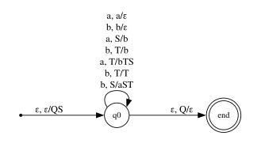
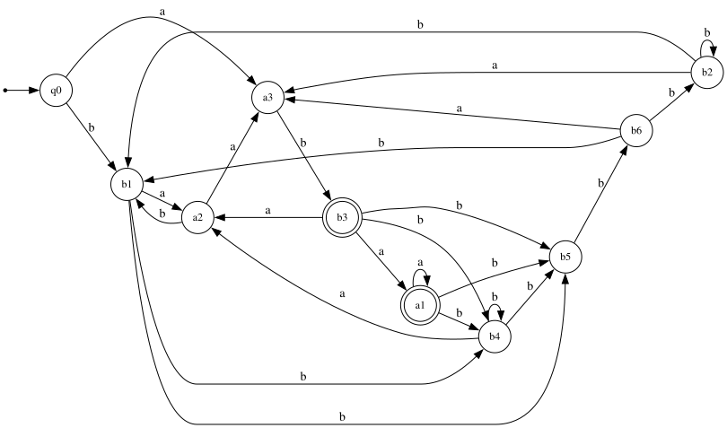

## Лабораторная работа №3 

Дана грамматика: 

$$
S \to bTSa\\
T \to aSTb\\
S \to ab\\
T \to bT\\
T \to bb\\
$$

#### Анализ на детерминизм

Построим PDA для этого языка и проанализируем возникший недетерминизм: 

Недетерминизм возник лишь при чтении $b$ с вершиной стека $T$, где мы имеем два варианта развития событий: рекурсивно добавлять $b$ или воспользоваться правилом $T \to bb$

Рассмотрим два слова с длинным общим префиксом:

$$
(ba)^{n}b~baab (bbbaba)^n\\
(ba)^{n}b~bbaba~(bbbaba)^{n}
$$

После прочтения общего префикса $(ba)^nb$, стек имеет вид $(aSbT)^naST$. 

Если в первом слове выбрать переход со снятием $T$ со стека, на вершине окажется $b$, а прочитать хотим $a$, что делает дальнейшее чтение слова невозможным.

Если во втором слове раскрыть $T$ рекурсивно, то дочитав до блока $(bbbaba)^n$ в стеке лежит $(aSbT)^{n+2}S$. Минимальная длина строки, необходимая для попадания в финальное состояние, равна $6(n+2) + 2$, но длина остатка слова равна $6n$, значит, при дальнейшем чтении стек останется непустым. 

#### Анализ на беспрефиксность

Рассмотрим слово $w_1 = bbbbbbaba$ и $w_2 = bbbbbbabaa$. Они принадлежат языку и выводятся из правил грамматики следующим образом:

$$
S \to bTSa \to b^6Sa \to bbbbbbaba = w_1 \\
S \to bTSa \to bbbSa \to bbbbTSaa \to bbbbbbabaa = w_2
$$. 

Так как $w_2 = w_1a$, $w_1$ является префиксом слова $w_2$, поэтому язык, порожденный грамматикой, не является беспрефиксным.

###### Язык не обладает LL-свойством, так как он недетерминирован

#### LL(1)-аппроксимация

Для начала линеаризуем грамматику и построим $First$, $Follow$ и $Last$ множества

$$ 
S \to b_1TSa_1\\
T \to a_2STb_2\\
S \to a_3b_3\\
T \to b_4T\\
T \to b_5b_6
$$

$$
First(G) = \lbrace b_1, a_3 \rbrace \\ 
Last(G) = \lbrace a_1, b_3 \rbrace\\
$$

\[
\begin{aligned}
Follow(G) &= \bigl\{
a_1a_1, a_1b_4, a_1b_5, b_1a_2, b_1b_4, b_1b_5, a_3b_3, a_2b_1, a_2a_3,\\
&\qquad b_2b_1, b_2b_2, b_2a_3, b_4b_4, b_4b_5, b_4a_2, b_5b_6,\\
&\qquad b_6b_1, b_6a_3, b_6b_2, b_3a_1, b_3a_2, b_3b_4, b_3b_5
\bigr\}.
\end{aligned}
\]

Получаем $LL(1)$-аппроксимацию:

Частично минимизируем:

#### Правила из пересечения грамматики и LL(1)-аппроксимации

$$
\langle 0, S, 0 \rangle \to b \langle 2, T, 2 \rangle \langle 2, S, 2 \rangle a\\
\langle 0, S, 0 \rangle \to b \langle 2, T, 6 \rangle \langle 6, S, 3 \rangle a\\
\langle 0, S, 1 \rangle \to b \langle 2, T, 2 \rangle \langle 2, S, 0 \rangle a\\
\langle 0, S, 1 \rangle \to b \langle 2, T, 5 \rangle \langle 5, S, 0 \rangle a\\
\langle 0, S, 1 \rangle \to b \langle 2, T, 6 \rangle \langle 6, S, 0 \rangle a\\
\langle 0, S, 3 \rangle \to a b\\
\langle 0, S, 4 \rangle \to b \langle 2, T, 2 \rangle \langle 2, S, 4 \rangle a\\
\langle 0, S, 4 \rangle \to b \langle 2, T, 5 \rangle \langle 5, S, 4 \rangle a\\
\langle 0, S, 4 \rangle \to b \langle 2, T, 6 \rangle \langle 6, S, 3 \rangle a\\
\langle 0, S, 4 \rangle \to b \langle 2, T, 6 \rangle \langle 6, S, 4 \rangle a\\
\langle 0, T, 2 \rangle \to a \langle 1, S, 0 \rangle \langle 0, T, 2 \rangle b\\
\langle 0, T, 2 \rangle \to a \langle 1, S, 0 \rangle \langle 0, T, 6 \rangle b\\
\langle 0, T, 2 \rangle \to a \langle 1, S, 1 \rangle \langle 1, T, 2 \rangle b\\
\langle 0, T, 2 \rangle \to a \langle 1, S, 1 \rangle \langle 1, T, 6 \rangle b\\
\langle 0, T, 2 \rangle \to a \langle 1, S, 4 \rangle \langle 4, T, 2 \rangle b\\
\langle 0, T, 2 \rangle \to a \langle 1, S, 4 \rangle \langle 4, T, 6 \rangle b\\
\langle 0, T, 2 \rangle \to b \langle 2, T, 2 \rangle\\
\langle 0, T, 2 \rangle \to b b\\
\langle 0, T, 5 \rangle \to a \langle 1, S, 0 \rangle \langle 0, T, 2 \rangle b\\
\langle 0, T, 5 \rangle \to a \langle 1, S, 1 \rangle \langle 1, T, 2 \rangle b\\
\langle 0, T, 5 \rangle \to a \langle 1, S, 4 \rangle \langle 4, T, 2 \rangle b\\
\langle 0, T, 5 \rangle \to b \langle 2, T, 5 \rangle\\
\langle 0, T, 5 \rangle \to b b\\
\langle 0, T, 6 \rangle \to a \langle 1, S, 0 \rangle \langle 0, T, 5 \rangle b\\
\langle 0, T, 6 \rangle \to a \langle 1, S, 0 \rangle \langle 0, T, 6 \rangle b\\
\langle 0, T, 6 \rangle \to a \langle 1, S, 1 \rangle \langle 1, T, 5 \rangle b\\
\langle 0, T, 6 \rangle \to a \langle 1, S, 1 \rangle \langle 1, T, 6 \rangle b\\
\langle 0, T, 6 \rangle \to a \langle 1, S, 4 \rangle \langle 4, T, 5 \rangle b\\
\langle 0, T, 6 \rangle \to a \langle 1, S, 4 \rangle \langle 4, T, 6 \rangle b\\
\langle 0, T, 6 \rangle \to b \langle 2, T, 6 \rangle\\
\langle 1, S, 0 \rangle \to b \langle 3, T, 2 \rangle \langle 2, S, 2 \rangle a\\
\langle 1, S, 0 \rangle \to b \langle 3, T, 6 \rangle \langle 6, S, 3 \rangle a\\
\langle 1, S, 1 \rangle \to b \langle 3, T, 2 \rangle \langle 2, S, 0 \rangle a\\
\langle 1, S, 1 \rangle \to b \langle 3, T, 5 \rangle \langle 5, S, 0 \rangle a\\
\langle 1, S, 1 \rangle \to b \langle 3, T, 6 \rangle \langle 6, S, 0 \rangle a\\
\langle 1, S, 4 \rangle \to b \langle 3, T, 2 \rangle \langle 2, S, 4 \rangle a\\
\langle 1, S, 4 \rangle \to b \langle 3, T, 5 \rangle \langle 5, S, 4 \rangle a\\
\langle 1, S, 4 \rangle \to b \langle 3, T, 6 \rangle \langle 6, S, 3 \rangle a\\
\langle 1, S, 4 \rangle \to b \langle 3, T, 6 \rangle \langle 6, S, 4 \rangle a\\
\langle 1, T, 2 \rangle \to b \langle 3, T, 2 \rangle\\
\langle 1, T, 2 \rangle \to b b\\
\langle 1, T, 5 \rangle \to b \langle 3, T, 5 \rangle\\
\langle 1, T, 5 \rangle \to b b\\
\langle 1, T, 6 \rangle \to b \langle 3, T, 6 \rangle\\
\langle 2, S, 0 \rangle \to b \langle 2, T, 2 \rangle \langle 2, S, 2 \rangle a\\
\langle 2, S, 0 \rangle \to b \langle 2, T, 6 \rangle \langle 6, S, 3 \rangle a\\
\langle 2, S, 0 \rangle \to b \langle 5, T, 2 \rangle \langle 2, S, 2 \rangle a\\
\langle 2, S, 0 \rangle \to b \langle 5, T, 6 \rangle \langle 6, S, 3 \rangle a\\
\langle 2, S, 2 \rangle \to a b\\
\langle 2, S, 4 \rangle \to b \langle 2, T, 2 \rangle \langle 2, S, 4 \rangle a\\
\langle 2, S, 4 \rangle \to b \langle 2, T, 5 \rangle \langle 5, S, 4 \rangle a\\
\langle 2, S, 4 \rangle \to b \langle 2, T, 6 \rangle \langle 6, S, 3 \rangle a\\
\langle 2, S, 4 \rangle \to b \langle 2, T, 6 \rangle \langle 6, S, 4 \rangle a\\
\langle 2, S, 4 \rangle \to b \langle 5, T, 2 \rangle \langle 2, S, 4 \rangle a\\
\langle 2, S, 4 \rangle \to b \langle 5, T, 5 \rangle \langle 5, S, 4 \rangle a\\
\langle 2, S, 4 \rangle \to b \langle 5, T, 6 \rangle \langle 6, S, 3 \rangle a\\
\langle 2, S, 4 \rangle \to b \langle 5, T, 6 \rangle \langle 6, S, 4 \rangle a\\
\langle 2, T, 2 \rangle \to a \langle 0, S, 0 \rangle \langle 0, T, 2 \rangle b\\
\langle 2, T, 2 \rangle \to a \langle 0, S, 0 \rangle \langle 0, T, 6 \rangle b\\
\langle 2, T, 2 \rangle \to a \langle 0, S, 1 \rangle \langle 1, T, 2 \rangle b\\
\langle 2, T, 2 \rangle \to a \langle 0, S, 1 \rangle \langle 1, T, 6 \rangle b\\
\langle 2, T, 2 \rangle \to a \langle 0, S, 3 \rangle \langle 3, T, 2 \rangle b\\
\langle 2, T, 2 \rangle \to a \langle 0, S, 3 \rangle \langle 3, T, 6 \rangle b\\
\langle 2, T, 2 \rangle \to a \langle 0, S, 4 \rangle \langle 4, T, 2 \rangle b\\
\langle 2, T, 2 \rangle \to a \langle 0, S, 4 \rangle \langle 4, T, 6 \rangle b\\
\langle 2, T, 2 \rangle \to b \langle 2, T, 2 \rangle\\
\langle 2, T, 2 \rangle \to b \langle 5, T, 2 \rangle\\
\langle 2, T, 2 \rangle \to b b\\
\langle 2, T, 5 \rangle \to a \langle 0, S, 0 \rangle \langle 0, T, 2 \rangle b\\
\langle 2, T, 5 \rangle \to a \langle 0, S, 1 \rangle \langle 1, T, 2 \rangle b\\
\langle 2, T, 5 \rangle \to a \langle 0, S, 3 \rangle \langle 3, T, 2 \rangle b\\
\langle 2, T, 5 \rangle \to a \langle 0, S, 4 \rangle \langle 4, T, 2 \rangle b\\
\langle 2, T, 5 \rangle \to b \langle 2, T, 5 \rangle\\
\langle 2, T, 5 \rangle \to b \langle 5, T, 5 \rangle\\
\langle 2, T, 5 \rangle \to b b\\
\langle 2, T, 6 \rangle \to a \langle 0, S, 0 \rangle \langle 0, T, 5 \rangle b\\
\langle 2, T, 6 \rangle \to a \langle 0, S, 0 \rangle \langle 0, T, 6 \rangle b\\
\langle 2, T, 6 \rangle \to a \langle 0, S, 1 \rangle \langle 1, T, 5 \rangle b\\
\langle 2, T, 6 \rangle \to a \langle 0, S, 1 \rangle \langle 1, T, 6 \rangle b\\
\langle 2, T, 6 \rangle \to a \langle 0, S, 3 \rangle \langle 3, T, 5 \rangle b\\
\langle 2, T, 6 \rangle \to a \langle 0, S, 3 \rangle \langle 3, T, 6 \rangle b\\
\langle 2, T, 6 \rangle \to a \langle 0, S, 4 \rangle \langle 4, T, 5 \rangle b\\
\langle 2, T, 6 \rangle \to a \langle 0, S, 4 \rangle \langle 4, T, 6 \rangle b\\
\langle 2, T, 6 \rangle \to b \langle 2, T, 6 \rangle\\
\langle 2, T, 6 \rangle \to b \langle 5, T, 6 \rangle\\
\langle 2, T, 6 \rangle \to b b\\
\langle 3, T, 2 \rangle \to a \langle 0, S, 0 \rangle \langle 0, T, 2 \rangle b\\
\langle 3, T, 2 \rangle \to a \langle 0, S, 0 \rangle \langle 0, T, 6 \rangle b\\
\langle 3, T, 2 \rangle \to a \langle 0, S, 1 \rangle \langle 1, T, 2 \rangle b\\
\langle 3, T, 2 \rangle \to a \langle 0, S, 1 \rangle \langle 1, T, 6 \rangle b\\
\langle 3, T, 2 \rangle \to a \langle 0, S, 3 \rangle \langle 3, T, 2 \rangle b\\
\langle 3, T, 2 \rangle \to a \langle 0, S, 3 \rangle \langle 3, T, 6 \rangle b\\
\langle 3, T, 2 \rangle \to a \langle 0, S, 4 \rangle \langle 4, T, 2 \rangle b\\
\langle 3, T, 2 \rangle \to a \langle 0, S, 4 \rangle \langle 4, T, 6 \rangle b\\
\langle 3, T, 2 \rangle \to a \langle 4, S, 0 \rangle \langle 0, T, 2 \rangle b\\
\langle 3, T, 2 \rangle \to a \langle 4, S, 0 \rangle \langle 0, T, 6 \rangle b\\
\langle 3, T, 2 \rangle \to a \langle 4, S, 1 \rangle \langle 1, T, 2 \rangle b\\
\langle 3, T, 2 \rangle \to a \langle 4, S, 1 \rangle \langle 1, T, 6 \rangle b\\
\langle 3, T, 2 \rangle \to a \langle 4, S, 2 \rangle \langle 2, T, 2 \rangle b\\
\langle 3, T, 2 \rangle \to a \langle 4, S, 2 \rangle \langle 2, T, 6 \rangle b\\
\langle 3, T, 2 \rangle \to a \langle 4, S, 4 \rangle \langle 4, T, 2 \rangle b\\
\langle 3, T, 2 \rangle \to a \langle 4, S, 4 \rangle \langle 4, T, 6 \rangle b\\
\langle 3, T, 2 \rangle \to a \langle 4, S, 5 \rangle \langle 5, T, 2 \rangle b\\
\langle 3, T, 2 \rangle \to a \langle 4, S, 5 \rangle \langle 5, T, 6 \rangle b\\
\langle 3, T, 2 \rangle \to b \langle 2, T, 2 \rangle\\
\langle 3, T, 2 \rangle \to b \langle 5, T, 2 \rangle\\
\langle 3, T, 2 \rangle \to b b\\
\langle 3, T, 5 \rangle \to a \langle 0, S, 0 \rangle \langle 0, T, 2 \rangle b\\
\langle 3, T, 5 \rangle \to a \langle 0, S, 1 \rangle \langle 1, T, 2 \rangle b\\
\langle 3, T, 5 \rangle \to a \langle 0, S, 3 \rangle \langle 3, T, 2 \rangle b\\
\langle 3, T, 5 \rangle \to a \langle 0, S, 4 \rangle \langle 4, T, 2 \rangle b\\
\langle 3, T, 5 \rangle \to a \langle 4, S, 0 \rangle \langle 0, T, 2 \rangle b\\
\langle 3, T, 5 \rangle \to a \langle 4, S, 1 \rangle \langle 1, T, 2 \rangle b\\
\langle 3, T, 5 \rangle \to a \langle 4, S, 2 \rangle \langle 2, T, 2 \rangle b\\
\langle 3, T, 5 \rangle \to a \langle 4, S, 4 \rangle \langle 4, T, 2 \rangle b\\
\langle 3, T, 5 \rangle \to a \langle 4, S, 5 \rangle \langle 5, T, 2 \rangle b\\
\langle 3, T, 5 \rangle \to b \langle 2, T, 5 \rangle\\
\langle 3, T, 5 \rangle \to b \langle 5, T, 5 \rangle\\
\langle 3, T, 5 \rangle \to b b\\
\langle 3, T, 6 \rangle \to a \langle 0, S, 0 \rangle \langle 0, T, 5 \rangle b\\
\langle 3, T, 6 \rangle \to a \langle 0, S, 0 \rangle \langle 0, T, 6 \rangle b\\
\langle 3, T, 6 \rangle \to a \langle 0, S, 1 \rangle \langle 1, T, 5 \rangle b\\
\langle 3, T, 6 \rangle \to a \langle 0, S, 1 \rangle \langle 1, T, 6 \rangle b\\
\langle 3, T, 6 \rangle \to a \langle 0, S, 3 \rangle \langle 3, T, 5 \rangle b\\
\langle 3, T, 6 \rangle \to a \langle 0, S, 3 \rangle \langle 3, T, 6 \rangle b\\
\langle 3, T, 6 \rangle \to a \langle 0, S, 4 \rangle \langle 4, T, 5 \rangle b\\
\langle 3, T, 6 \rangle \to a \langle 0, S, 4 \rangle \langle 4, T, 6 \rangle b\\
\langle 3, T, 6 \rangle \to a \langle 4, S, 0 \rangle \langle 0, T, 5 \rangle b\\
\langle 3, T, 6 \rangle \to a \langle 4, S, 0 \rangle \langle 0, T, 6 \rangle b\\
\langle 3, T, 6 \rangle \to a \langle 4, S, 1 \rangle \langle 1, T, 5 \rangle b\\
\langle 3, T, 6 \rangle \to a \langle 4, S, 1 \rangle \langle 1, T, 6 \rangle b\\
\langle 3, T, 6 \rangle \to a \langle 4, S, 2 \rangle \langle 2, T, 5 \rangle b\\
\langle 3, T, 6 \rangle \to a \langle 4, S, 2 \rangle \langle 2, T, 6 \rangle b\\
\langle 3, T, 6 \rangle \to a \langle 4, S, 4 \rangle \langle 4, T, 5 \rangle b\\
\langle 3, T, 6 \rangle \to a \langle 4, S, 4 \rangle \langle 4, T, 6 \rangle b\\
\langle 3, T, 6 \rangle \to a \langle 4, S, 5 \rangle \langle 5, T, 5 \rangle b\\
\langle 3, T, 6 \rangle \to a \langle 4, S, 5 \rangle \langle 5, T, 6 \rangle b\\
\langle 3, T, 6 \rangle \to b \langle 2, T, 6 \rangle\\
\langle 3, T, 6 \rangle \to b \langle 5, T, 6 \rangle\\
\langle 3, T, 6 \rangle \to b b\\
\langle 4, S, 0 \rangle \to b \langle 2, T, 2 \rangle \langle 2, S, 2 \rangle a\\
\langle 4, S, 0 \rangle \to b \langle 2, T, 6 \rangle \langle 6, S, 3 \rangle a\\
\langle 4, S, 0 \rangle \to b \langle 5, T, 2 \rangle \langle 2, S, 2 \rangle a\\
\langle 4, S, 0 \rangle \to b \langle 5, T, 6 \rangle \langle 6, S, 3 \rangle a\\
\langle 4, S, 1 \rangle \to b \langle 2, T, 2 \rangle \langle 2, S, 0 \rangle a\\
\langle 4, S, 1 \rangle \to b \langle 2, T, 5 \rangle \langle 5, S, 0 \rangle a\\
\langle 4, S, 1 \rangle \to b \langle 2, T, 6 \rangle \langle 6, S, 0 \rangle a\\
\langle 4, S, 1 \rangle \to b \langle 5, T, 2 \rangle \langle 2, S, 0 \rangle a\\
\langle 4, S, 1 \rangle \to b \langle 5, T, 5 \rangle \langle 5, S, 0 \rangle a\\
\langle 4, S, 1 \rangle \to b \langle 5, T, 6 \rangle \langle 6, S, 0 \rangle a\\
\langle 4, S, 2 \rangle \to a b\\
\langle 4, S, 4 \rangle \to b \langle 2, T, 2 \rangle \langle 2, S, 4 \rangle a\\
\langle 4, S, 4 \rangle \to b \langle 2, T, 5 \rangle \langle 5, S, 4 \rangle a\\
\langle 4, S, 4 \rangle \to b \langle 2, T, 6 \rangle \langle 6, S, 3 \rangle a\\
\langle 4, S, 4 \rangle \to b \langle 2, T, 6 \rangle \langle 6, S, 4 \rangle a\\
\langle 4, S, 4 \rangle \to b \langle 5, T, 2 \rangle \langle 2, S, 4 \rangle a\\
\langle 4, S, 4 \rangle \to b \langle 5, T, 5 \rangle \langle 5, S, 4 \rangle a\\
\langle 4, S, 4 \rangle \to b \langle 5, T, 6 \rangle \langle 6, S, 3 \rangle a\\
\langle 4, S, 4 \rangle \to b \langle 5, T, 6 \rangle \langle 6, S, 4 \rangle a\\
\langle 4, S, 5 \rangle \to a b\\
\langle 4, T, 2 \rangle \to a \langle 4, S, 0 \rangle \langle 0, T, 2 \rangle b\\
\langle 4, T, 2 \rangle \to a \langle 4, S, 0 \rangle \langle 0, T, 6 \rangle b\\
\langle 4, T, 2 \rangle \to a \langle 4, S, 1 \rangle \langle 1, T, 2 \rangle b\\
\langle 4, T, 2 \rangle \to a \langle 4, S, 1 \rangle \langle 1, T, 6 \rangle b\\
\langle 4, T, 2 \rangle \to a \langle 4, S, 2 \rangle \langle 2, T, 2 \rangle b\\
\langle 4, T, 2 \rangle \to a \langle 4, S, 2 \rangle \langle 2, T, 6 \rangle b\\
\langle 4, T, 2 \rangle \to a \langle 4, S, 4 \rangle \langle 4, T, 2 \rangle b\\
\langle 4, T, 2 \rangle \to a \langle 4, S, 4 \rangle \langle 4, T, 6 \rangle b\\
\langle 4, T, 2 \rangle \to a \langle 4, S, 5 \rangle \langle 5, T, 2 \rangle b\\
\langle 4, T, 2 \rangle \to a \langle 4, S, 5 \rangle \langle 5, T, 6 \rangle b\\
\langle 4, T, 2 \rangle \to b \langle 2, T, 2 \rangle\\
\langle 4, T, 2 \rangle \to b \langle 5, T, 2 \rangle\\
\langle 4, T, 2 \rangle \to b b\\
\langle 4, T, 5 \rangle \to a \langle 4, S, 0 \rangle \langle 0, T, 2 \rangle b\\
\langle 4, T, 5 \rangle \to a \langle 4, S, 1 \rangle \langle 1, T, 2 \rangle b\\
\langle 4, T, 5 \rangle \to a \langle 4, S, 2 \rangle \langle 2, T, 2 \rangle b\\
\langle 4, T, 5 \rangle \to a \langle 4, S, 4 \rangle \langle 4, T, 2 \rangle b\\
\langle 4, T, 5 \rangle \to a \langle 4, S, 5 \rangle \langle 5, T, 2 \rangle b\\
\langle 4, T, 5 \rangle \to b \langle 2, T, 5 \rangle\\
\langle 4, T, 5 \rangle \to b \langle 5, T, 5 \rangle\\
\langle 4, T, 5 \rangle \to b b\\
\langle 4, T, 6 \rangle \to a \langle 4, S, 0 \rangle \langle 0, T, 5 \rangle b\\
\langle 4, T, 6 \rangle \to a \langle 4, S, 0 \rangle \langle 0, T, 6 \rangle b\\
\langle 4, T, 6 \rangle \to a \langle 4, S, 1 \rangle \langle 1, T, 5 \rangle b\\
\langle 4, T, 6 \rangle \to a \langle 4, S, 1 \rangle \langle 1, T, 6 \rangle b\\
\langle 4, T, 6 \rangle \to a \langle 4, S, 2 \rangle \langle 2, T, 5 \rangle b\\
\langle 4, T, 6 \rangle \to a \langle 4, S, 2 \rangle \langle 2, T, 6 \rangle b\\
\langle 4, T, 6 \rangle \to a \langle 4, S, 4 \rangle \langle 4, T, 5 \rangle b\\
\langle 4, T, 6 \rangle \to a \langle 4, S, 4 \rangle \langle 4, T, 6 \rangle b\\
\langle 4, T, 6 \rangle \to a \langle 4, S, 5 \rangle \langle 5, T, 5 \rangle b\\
\langle 4, T, 6 \rangle \to a \langle 4, S, 5 \rangle \langle 5, T, 6 \rangle b\\
\langle 4, T, 6 \rangle \to b \langle 2, T, 6 \rangle\\
\langle 4, T, 6 \rangle \to b \langle 5, T, 6 \rangle\\
\langle 4, T, 6 \rangle \to b b\\
\langle 5, S, 0 \rangle \to b \langle 6, T, 2 \rangle \langle 2, S, 2 \rangle a\\
\langle 5, S, 0 \rangle \to b \langle 6, T, 6 \rangle \langle 6, S, 3 \rangle a\\
\langle 5, S, 4 \rangle \to b \langle 6, T, 2 \rangle \langle 2, S, 4 \rangle a\\
\langle 5, S, 4 \rangle \to b \langle 6, T, 5 \rangle \langle 5, S, 4 \rangle a\\
\langle 5, S, 4 \rangle \to b \langle 6, T, 6 \rangle \langle 6, S, 3 \rangle a\\
\langle 5, S, 4 \rangle \to b \langle 6, T, 6 \rangle \langle 6, S, 4 \rangle a\\
\langle 5, T, 2 \rangle \to b \langle 6, T, 2 \rangle\\
\langle 5, T, 2 \rangle \to b b\\
\langle 5, T, 5 \rangle \to b \langle 6, T, 5 \rangle\\
\langle 5, T, 6 \rangle \to b \langle 6, T, 6 \rangle\\
\langle 5, T, 6 \rangle \to b b\\
\langle 6, S, 0 \rangle \to b \langle 2, T, 2 \rangle \langle 2, S, 2 \rangle a\\
\langle 6, S, 0 \rangle \to b \langle 2, T, 6 \rangle \langle 6, S, 3 \rangle a\\
\langle 6, S, 0 \rangle \to b \langle 6, T, 2 \rangle \langle 2, S, 2 \rangle a\\
\langle 6, S, 0 \rangle \to b \langle 6, T, 6 \rangle \langle 6, S, 3 \rangle a\\
\langle 6, S, 3 \rangle \to a b\\
\langle 6, S, 4 \rangle \to b \langle 2, T, 2 \rangle \langle 2, S, 4 \rangle a\\
\langle 6, S, 4 \rangle \to b \langle 2, T, 5 \rangle \langle 5, S, 4 \rangle a\\
\langle 6, S, 4 \rangle \to b \langle 2, T, 6 \rangle \langle 6, S, 3 \rangle a\\
\langle 6, S, 4 \rangle \to b \langle 2, T, 6 \rangle \langle 6, S, 4 \rangle a\\
\langle 6, S, 4 \rangle \to b \langle 6, T, 2 \rangle \langle 2, S, 4 \rangle a\\
\langle 6, S, 4 \rangle \to b \langle 6, T, 5 \rangle \langle 5, S, 4 \rangle a\\
\langle 6, S, 4 \rangle \to b \langle 6, T, 6 \rangle \langle 6, S, 3 \rangle a\\
\langle 6, S, 4 \rangle \to b \langle 6, T, 6 \rangle \langle 6, S, 4 \rangle a\\
\langle 6, T, 2 \rangle \to a \langle 1, S, 0 \rangle \langle 0, T, 2 \rangle b\\
\langle 6, T, 2 \rangle \to a \langle 1, S, 0 \rangle \langle 0, T, 6 \rangle b\\
\langle 6, T, 2 \rangle \to a \langle 1, S, 1 \rangle \langle 1, T, 2 \rangle b\\
\langle 6, T, 2 \rangle \to a \langle 1, S, 1 \rangle \langle 1, T, 6 \rangle b\\
\langle 6, T, 2 \rangle \to a \langle 1, S, 4 \rangle \langle 4, T, 2 \rangle b\\
\langle 6, T, 2 \rangle \to a \langle 1, S, 4 \rangle \langle 4, T, 6 \rangle b\\
\langle 6, T, 2 \rangle \to b \langle 2, T, 2 \rangle\\
\langle 6, T, 2 \rangle \to b \langle 6, T, 2 \rangle\\
\langle 6, T, 2 \rangle \to b b\\
\langle 6, T, 5 \rangle \to a \langle 1, S, 0 \rangle \langle 0, T, 2 \rangle b\\
\langle 6, T, 5 \rangle \to a \langle 1, S, 1 \rangle \langle 1, T, 2 \rangle b\\
\langle 6, T, 5 \rangle \to a \langle 1, S, 4 \rangle \langle 4, T, 2 \rangle b\\
\langle 6, T, 5 \rangle \to b \langle 2, T, 5 \rangle\\
\langle 6, T, 5 \rangle \to b \langle 6, T, 5 \rangle\\
\langle 6, T, 5 \rangle \to b b\\
\langle 6, T, 6 \rangle \to a \langle 1, S, 0 \rangle \langle 0, T, 5 \rangle b\\
\langle 6, T, 6 \rangle \to a \langle 1, S, 0 \rangle \langle 0, T, 6 \rangle b\\
\langle 6, T, 6 \rangle \to a \langle 1, S, 1 \rangle \langle 1, T, 5 \rangle b\\
\langle 6, T, 6 \rangle \to a \langle 1, S, 1 \rangle \langle 1, T, 6 \rangle b\\
\langle 6, T, 6 \rangle \to a \langle 1, S, 4 \rangle \langle 4, T, 5 \rangle b\\
\langle 6, T, 6 \rangle \to a \langle 1, S, 4 \rangle \langle 4, T, 6 \rangle b\\
\langle 6, T, 6 \rangle \to b \langle 2, T, 6 \rangle\\
\langle 6, T, 6 \rangle \to b \langle 6, T, 6 \rangle\\
\langle 6, T, 6 \rangle \to b b\\
$$

#### LR(0)-аппроксимация

Построим позиционный автомат: 

/lr.svg)

Промежуточное представление с $\epsilon$-переходами вместо нетерминальных переходов:

/lr_eps.svg)

Детерминизированный автомат: 

/lr_det.svg)

Минимизированный автомат: 

/lr_min.svg)

#### Правила из пересечения грамматики и LR(0)-аппроксимации

$$
\langle 0, S, 4 \rangle \to a b\\
\langle 0, S, 5 \rangle \to b \langle 1, T, 1 \rangle \langle 1, S, 5 \rangle a\\
\langle 0, S, 5 \rangle \to b \langle 1, T, 1 \rangle \langle 1, S, 4 \rangle a\\
\langle 1, S, 4 \rangle \to a b\\
\langle 1, S, 5 \rangle \to b \langle 1, T, 1 \rangle \langle 1, S, 5 \rangle a\\
\langle 1, S, 5 \rangle \to b \langle 1, T, 1 \rangle \langle 1, S, 4 \rangle a\\
\langle 2, S, 4 \rangle \to a b\\
\langle 2, S, 5 \rangle \to b \langle 4, T, 1 \rangle \langle 1, S, 5 \rangle a\\
\langle 2, S, 5 \rangle \to b \langle 4, T, 1 \rangle \langle 1, S, 4 \rangle a\\
\langle 3, S, 5 \rangle \to b \langle 4, T, 1 \rangle \langle 1, S, 5 \rangle a\\
\langle 3, S, 5 \rangle \to b \langle 4, T, 1 \rangle \langle 1, S, 4 \rangle a\\
\langle 4, S, 4 \rangle \to a b\\
\langle 4, S, 5 \rangle \to b \langle 1, T, 1 \rangle \langle 1, S, 5 \rangle a\\
\langle 4, S, 5 \rangle \to b \langle 1, T, 1 \rangle \langle 1, S, 4 \rangle a\\
\langle 5, S, 4 \rangle \to a b\\
\langle 5, S, 5 \rangle \to b \langle 4, T, 1 \rangle \langle 1, S, 5 \rangle a\\
\langle 5, S, 5 \rangle \to b \langle 4, T, 1 \rangle \langle 1, S, 4 \rangle a\\
\langle 0, T, 1 \rangle \to a \langle 3, S, 5 \rangle \langle 5, T, 1 \rangle b\\
\langle 0, T, 1 \rangle \to b \langle 1, T, 1 \rangle\\
\langle 0, T, 1 \rangle \to b b\\
\langle 1, T, 1 \rangle \to a \langle 2, S, 5 \rangle \langle 5, T, 1 \rangle b\\
\langle 1, T, 1 \rangle \to a \langle 2, S, 4 \rangle \langle 4, T, 1 \rangle b\\
\langle 1, T, 1 \rangle \to b \langle 1, T, 1 \rangle\\
\langle 1, T, 1 \rangle \to b b\\
\langle 2, T, 1 \rangle \to a \langle 3, S, 5 \rangle \langle 5, T, 1 \rangle b\\
\langle 2, T, 1 \rangle \to b \langle 4, T, 1 \rangle\\
\langle 2, T, 1 \rangle \to b b\\
\langle 3, T, 1 \rangle \to b \langle 4, T, 1 \rangle\\
\langle 3, T, 1 \rangle \to b b\\
\langle 4, T, 1 \rangle \to a \langle 5, S, 5 \rangle \langle 5, T, 1 \rangle b\\
\langle 4, T, 1 \rangle \to a \langle 5, S, 4 \rangle \langle 4, T, 1 \rangle b\\
\langle 4, T, 1 \rangle \to b \langle 1, T, 1 \rangle\\
\langle 4, T, 1 \rangle \to b b\\
\langle 5, T, 1 \rangle \to a \langle 5, S, 5 \rangle \langle 5, T, 1 \rangle b\\
\langle 5, T, 1 \rangle \to a \langle 5, S, 4 \rangle \langle 4, T, 1 \rangle b\\
\langle 5, T, 1 \rangle \to b \langle 4, T, 1 \rangle \\
\langle 5, T, 1 \rangle \to b b \\
$$