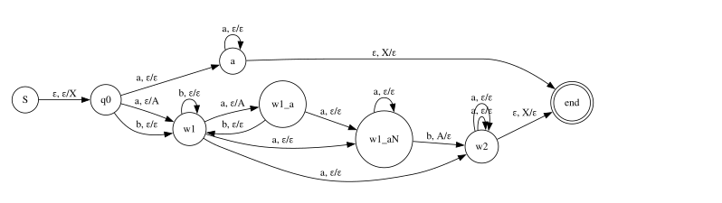
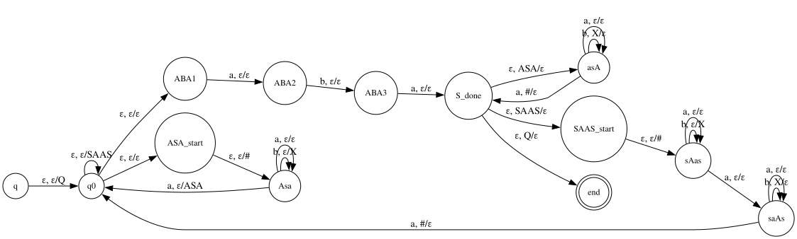

## РК2
### Вариант 18

#### Задача 1

* Язык $SRS:$ $a \to b^2$, $b^3a^2 \to a$ c базисом $a^{3^n}b^{2^n}$
* Проанализировать язык $L = B \cup T^*B$ 

Заметим, что:
* Оба правила уменьшают количество $a$ в строке
* Любое слово, принадлежащее языку, содержит как минимум $2^n$ символов $b$, так как хвостовые $b$ невозможно без $a$ после них

Попробуем доказать, что язык $L$ не является контекстно-свободным по лемме о накачке.

Выберем длину накачки $p$ и рассмотрим $w = a^{3^n}b^{2^n}$, где $n$ выбрано так, что $p < 2^n$, и тогда $|w| > p$

Разобьем слово $w = uvxyz$ и выберем $i = 2$. Тогда $w' = uv^ixy^iz \in L$

В таком накачке мы добавляем в $v$ и $y$ столько же символов $a$ и $b$, сколько содержалось в слове $w$:

$$
|w'|_a = |w|_a + |v|_a + |y|_a\\
|w'|_b = |w|_a + |v|_b + |v|_b
$$

$$\begin{align}
|vxy| \le p \Rightarrow |w'|_b \le 2^n + p < 2^n + 2^n = 2^{n+1}
\end{align}
$$
 
**Рассмотрим возможные случаи, опираясь на количество $a$:**

1. $|w'|_a > |w|_a$ (в $|vxy|$ попали какие-то символы $a$)

$|w'|$ должно принадлежать языку, то есть получаться цепочкой переписываний какого-то базового слова $a^{3^m}b^{2^m}$. 

Если $m > n$, то получается что  $|w'|_b$ должно быть больше или равно $2^m$, то есть больше или равно $2^n+1$, но с другой стороны $|w'|_b < 2^n$. Противоречие.

Если $m \le n$, то $3^m \le 3^n$, но мы можем только уменьшать число $a$ переписываниями

Получается, что если символы $a$ попали в разбиение, то $w' \notin L$

2. $|w'|_a = |w|_a$ (в $|vxy|$ не попали символы $a$)

Аналогично $|w'|$ должно получаться цепочкой переписываний из какого-то $a^{3^m}b^{2^m}$

Если $m > n$, то тогда в $|w'|$ должно быть больше $2^m$ симвоволов $b$, но $|w'|_b < 2^{n+1} < 2^m$, получили противоречие

Если $m = n$, то количество символов $b$ не должно было измениться, но $|vy| \ge 1$, то есть хотя бы один символ мы удвоили и это тоже невозможно.  

Если $m < n$, то снова получается что мы увеличили количество символов $a$, что тоже невозможно, так как каждое правило их количество уменьшает. 

То есть в таком случае $w' \notin L$. 

**Получается, что при любом возможном разбиении слова $w$ выходит, что $w' \notin L$, значит, язык не является контекстно-свободным.**

#### Задача 2

* Язык $L = (w_1a^nw_2 \mid |w_1|_a = |w_2|_b \wedge aa \notin |w_1|)$

Можем построить недетерминированный автомат с магазинной памятью, поэтому язык контекстно-свободный: 

Попробуем доказать недетерминизм. Рассмотрим пересечение $L$ и $R = (ab)^*aa(b)^*$. 

$$
K = L \cap R = (ab)^taab^m
$$

При этом каждое слово из $K$ может быть разбито на $w_1a^nw_2$, где $|w_1|_a = |w_2|_b$, $n \ge 0$. 

И так как $w_1$ не должно содержать $aa$, то максимальное число $a$ в $w_1$ будет $t + 1$. Тогда $0 \le m \le t + 1$

Пусть $p$ - длина накачки. Рассмотрим $w = (ab)^{p+2}aab^{p+2}$ и $w' = (ab)^{p+2}aab^{p+3}$

$$
x = (ab)^{p+2}aab^{p+1}\\
y = b\\
z = bb\\
w = xy\\
w' = xz
$$

Попробуем накачать префикс $x = x_1x_2x_3, |x_2x_3| \le p, |x_2| > 0$ 

Из ограничения длины суффикса следует, что он содержит только символы $b$ из хвоста $b^{p+1}$. Возьмем $i = 2$, тогда 

$$ 
w_1 = (ab)^{p+2}aab^{p+2+r}\\
w_1' = (ab)^{p+2}aab^{p+3+r}\\
|x_2| > 0 \Rightarrow r > 0
$$

$$
p + 2 + r \le p + 3 \Rightarrow r \le 1\\
p + 3 + r \le p + 3 \Rightarrow r \le 0
$$

Получается, что накачать $|w'|$ не получилось, значит, первое условие теоремы не выполнено.

Если мы будем накачивать еще и $y$ и $z$, то символов $b$ станет лишь больше, а вот количество $a$ в первом подслове мы увеличить не сможем за счет "разделителя" $aa$.

Таким образом, $K$ не является DCFL, а так как множество DCFL замкнуто относительно пересечения с регулярными языками, $L$ тоже не DCFL.

#### Задача 3

Язык, заданный атрибутивной грамматикой:

* $ S \to ASA $ ; $A_1.b == A_2.b$
* $ S \to SAAS $ ; $ A_1.b == A_2.b$
* $ S \to aba $
* $ A \to aA $ ; $A_0.b := A_1.b$
* $ A \to bA $ ; $A_0.b := A_1.b + 1$
* $ A \to a $ ; $A.b := 0$

Терминал $A$ задает все возможные слова над алфавитом $a, b$, которые заканчиваются буквой $a$.

Первые два правила обеспечивают равенство символов $b$ при раскрытии определенных пар $A$ внутри двух $S$ или слева и справа от $S$.

Построим NPDA, чтобы показать, что язык ялвяется контекстно-свободным:

Проверим, является ли этот язык регулярным по лемме о накачке для регулярных языков. Возьмем слово $w$, раскрыв $S \to ASA \to AabaA \to b^naabab^na$, где $n$ - длина накачки.

$$ w = b^naabab^na\\
|xy| \le n, |y| \ge 1 $$

Получается, что $xy$ включается в себя сколько-то $b$ из первого блока, не больше $n$. Возьмем $i = 0$. Тогда 

$$
w' = b^{n - p}aabab^na$$

Получается, что в левом блоке букв $b$ стало меньше, чем в правом, но по атрибутивному правилу такого не должно быть, а получить слово $w$, раскрыв $S$ иным образом, мы не можем, ведь тогда в слове должна появиться еще как минимум один нетерминал $S$, раскрытый как $aba$, а здесь такой "разделитель" только один, следовательно, слева и справа от него должно быть одинаковое число $b$. 

Значит, L - КС, но не регулярный. 